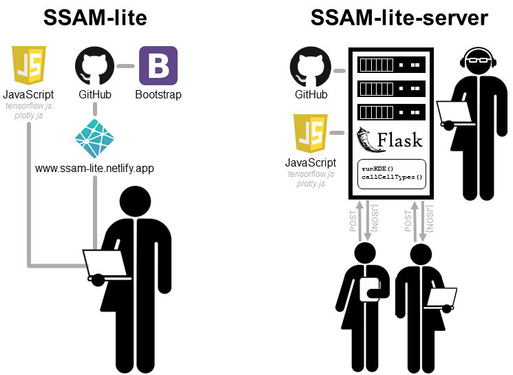

############
Installation
############

SSAM-lite comes in two flavours -- SSAM-lite and SSAM-lite-server.
While the usage is almost identical the installation differs quite a lot.
If you need some help deciding which of the two fits your needs best and 
what the differences are follow the guide ":ref:`local-or-server`"

.. _requirements:

Requirements
============

SSAM-lite and SSAM-lite-server should run on all modern browsers supporting JavaScript
and WebGL. It has been verified to run on Firefox, Chrome, Edge and Safari.

SSAM-lite requires an internet connection to access the TensorFlow.js (v2.0.0) 
library.

SSAM-lite-server requires Python (v3.9.7) as well as the Python packages 
Flask (v0.8), pandas (v1.3.2), NumPy (v1.20.3), and Numba (v0.53.1). It also requires the 
TensorFlow.js (v2.0.0), Plotly (v2.5.1), and Bootstrap (v4.0.0) JavaScript libraries.
However, these will be downloaded upon first setup 
and after that, no internet connection is required anymore.

SSAM-lite
=========

SSAM-lite is accesible via https://ssam-lite.bihealth.org, and does not need to be installed.

However, if you want to have a local copy of the code or run an older version, installation is possible and 
could not be easier. You either clone the `GitHub repository <https://github.com/HiDiHlabs/ssam-lite>`__

.. code-block:: bash

   git clone https://github.com/HiDiHlabs/ssam-lite.git

or click `here <https://github.com/HiDiHlabs/ssam-lite/archive/refs/heads/main.zip>`__ 
to download it as zip-file from GitHub and then extract it.

That is literally all, you are ready to go.

SSAM-lite-server
================

To install SSAM-lite-server you first need to clone the
`GitHub repository <https://github.com/HiDiHlabs/ssam-lite-server>`__

.. code-block:: bash

    git clone https://github.com/HiDiHlabs/ssam-lite-server.git

Next, we change into the cloned directory, create a ``conda`` environment including 
all packages and dependencies, and activate it.

.. code-block:: bash

    cd ssam-lite-server
    conda env create -f environment_ssam-lite-server.yml
    conda activate ssam-lite-server

.. note::

    You can adjust the YAML file to set the environment name to your preferences. Or 
    alternatively, create your own environment and install the required Python version and
    packages with the following command.

    .. code-block:: bash

        conda install python=3.9.7 flask=0.8 numpy=1.20.3 pandas=1.3.2 numba=0.53.1

We also retrieve the static files required by SSAM-lite-server including the Bootstrap, Plotly 
and TensorFlow.js JavaScript libraries.

.. code-block:: bash

    python fetch_static_files.py

Finally, start the Flask app (the default port will be 5000).

.. code-block:: bash

    export FLASK_APP=run.py
    flask run

.. note::

   The port and further settings can be made in the *run.py* file or when starting the app with
   ``flask run``. For further information we would refer the reader to the 
   `Flask documentation <https://flask.palletsprojects.com/>`__.