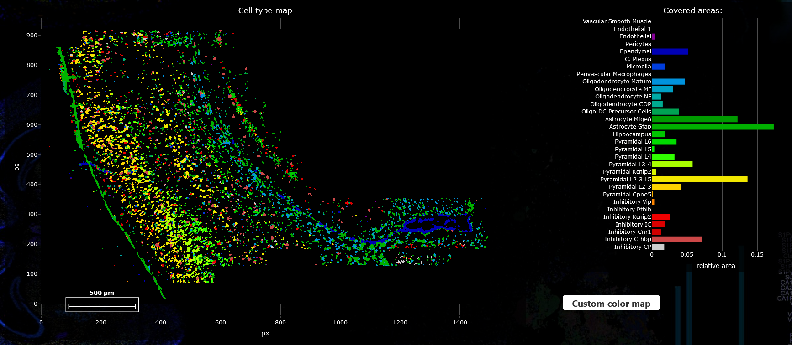

####################
Usage
####################

Open SSAM-lite
==============

SSAM-lite will be opened (and executed) in your Web Browser. For a list of compatible Browsers
read :ref:`supported-browsers`. Connecting to SSAM-lite depends on whether you want to use the
*solo* or *server* version. However, the usage afterwards will be (almost) identical.

SSAM-lite-solo
--------------

SSAM-lite-solo runs locally on your computer. It is executed by your Browser
and to open it you onyl need to navigate to the unzipped SSAM-lite directory
and double-click the *index.html* to open it in your default Web Browser.

SSAM-lite-server
----------------

To connet to SSAM-lite-server, you will need to to open your favourite Web Browser (not IE)
and enter the correct IP address and port in the form {ip}:{port} (e.g. 127.0.0.1:5000).
However, the IP and port depends on your local setup. Talk to your SSAM-lite coordinator.

Data
===========

To be able to use SSAM-lite you need to prepare your data in csv format.

Two input files are required:

mRNA Coordinates
    This file needs to be of the form Gene, x-coordinate, y-coordinate.
    The name of the headers are irrelevant, however their order needs to be kept.
    Negative coordinates are possible.

    +----------+-----------+-----------+
    | Gene     | x         | y         |
    +----------+-----------+-----------+
    | Gene A   |   0.5     |   1.3     |
    +----------+-----------+-----------+
    | Gene A   |   1.1     |   2.1     |
    +----------+-----------+-----------+
    | Gene B   |   0.4     |   0.5     |
    +----------+-----------+-----------+

Gene Signatures
    This file should be a matrix of Cell types by Genes. 
    The first column and row contains the names of Cell types and Genes, respectively. All the other cell values
    are gene scores ... TODO  how to define this ...
    This will later be used to assign each pixel to a cell type (or leave them unclassified)
    based on the Kernel Density Estimation.

    +--------------+----------+-----------+-----------+
    |              | Gene A   | Gene B    | Gene C    |
    +--------------+----------+-----------+-----------+
    | Celltype A   |    0.5   |   -0.5    |   1.3     |
    +--------------+----------+-----------+-----------+
    | Celltype B   |    -0.2  |   1.1     |   2.1     |
    +--------------+----------+-----------+-----------+
    | Celltype C   |    0.3   |   0.4     |   0.5     |
    +--------------+----------+-----------+-----------+

.. note::
    The name of the genes sre not relevant as there is no database used in the background.
    But remember that the gene names from the coordinates and the signatures need to be the same
    (or at least the two sets of names must be at least partially overlapping).

Parameters
===========

For a deep understanding of the SSAM framework we would refer the user to the
`SSAM publication <https://www.nature.com/articles/s41467-021-23807-4>`__,
however we will briefly describe the purpose and effect of the parameters
that can be set by the user to obtain optimal results.

Vector field width
    asdhas

KDE kernel bandwidth (sigma)
    dsälifhsdfälgh

Cell assignment threshold
    sdlfh

Analysis
========

To run the analysis, you start by clicking "Run Kernel Density Estimation" below
"Step 1: Kernel Density Estimation" and wait until processing is finished.
After it finished, the KDE estimates will be displayed in a plot (see example below).
This step is the computationally most expensive and might tak a few minutes.

.. note::
    Your Browser might warn you that the current site is slowing it down.
    This is normal due to the heavy computation running in the background and can be ignored.

.. image:: ../res/imgs/KDE.png
  :width: 600
  :alt: KDE estimation given the previously set parameters

Next, given the KDE estimates you can start inferring cell types.
Scroll down to "Step 2: Cell Assignments" and click on "Infer Cell Types".
The inferred cell types will be displayed in a new plot.

If you are not content with the results you can go back to the parameters section
and refine those before rerunning the analysis.

Save results
================

All plots are produced with `Plotly <https://plotly.com/>`__ and can be downloaded
by hovering over the plot which triggers a legend to appear in the upper right corner,
now click the Camera icon which lets you download the current plot as png file.
