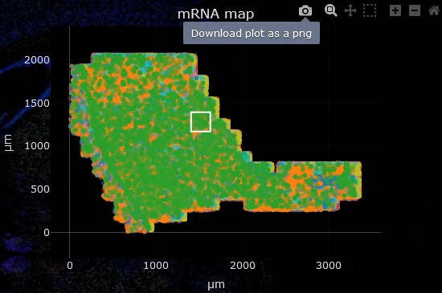

.. _user-guide:

####################
Usage
####################

This s a comprehensive user guide on how to navigate within and analyse your data with
SSAM-lite. However, there is also a short in-app tutorial available covering all important
steps. To start it just click on the "Tutorial" button that is on the start screen when you 
open SSAM-lite.

Test Data
==============

If you want to follow our usage guide along with some sample data you can download a sample data set from
Zenodo (https://zenodo.org/record/5517606).

Two sample data sets are available:

#. **Codeluppi_osmFISH**: an osmFISH dataset of the mouse somatosensory cortex from `Codeluppi et al., Nature methods, 2018 <https://www.nature.com/articles/s41592-018-0175-z>`__.
#. **Tosti_ISS_Pancreas**: an ISS dataset of the human pancreas from `Tosti et al., Gastroenterology, 2021 <https://doi.org/10.1053/j.gastro.2020.11.010>`__.

The datasets have been modified to fit the SSAM-lite input format. You can also find further information on the datasets
(such as number of mRNA spots etc.) on Zenodo or the *README* file within each directory once you downloaded it.

We will be using the *Codeluppi_osmFISH* dataset in this user guide to demonstrate the analysis.

Open SSAM-lite
==============

SSAM-lite will be opened (and executed) in your web browser. For a list of requirements
read ":ref:`requirements`". Connecting to SSAM-lite depends on whether you want to use the
*local* or *server* version. However, the usage afterwards will be (almost) identical.

SSAM-lite
---------

SSAM-lite can be opened by entering https://ssam-lite.bihealth.org in the address bar 
of your favourite web browser. Alternatively, if you decided to download the source code 
from GitHub you can double-click *SSAM-lite.html* and it will open in your default 
web browser.

Importantly, even if you decide to access SSAM-lite via the provided website, 
SSAM-lite is executed locally by your browser. That means that it 
*i*) uses the computational ressources of your device and *ii*) none of the analysed data will 
be transferred to any other device.

SSAM-lite-server
----------------

To connect to SSAM-lite-server, you will need to to open your favourite web browser
and type the correct IP address and port in the form {ip}:{port} (e.g. 127.0.0.1:5000) into the address bar.
However, the IP and port depends on your local setup. Talk to your responsible SSAM-lite coordinator.

Navigation
===========

Navigation is straight-forward. You can either scroll up and down to switch between the different steps
or you can use the navigation bar in the top of the window to directly jump to any section.

Furthermore, the "Get going!" button will bring you to the data center to start the analysis
by uploading your data.

.. _plot-navigation:

Adjusting plots
----------------

SSAM-lite lets you interactively explore and adjust the plots to your needs.

- Zooming in: right drag an area to zoom into
- Navigate: Shift + right drag
- Original view: double click
- Hide/display genes or cell types: click item in legend (double click hides/displays all except selected)

Alternatively, when hovering over a plot a small control panel will be displayed in the top right corner
which offers some additional functionality.

.. image:: ../res/imgs/ControlPanel.png
        :width: 250
        :align: center
        :alt: Control panel for plots    

|

For some of the plots, additional information on a data point can be displayed by hovering over it.

Data
===========

The data will be uploaded in the **Data Center** section of the tool. Just click the "Coordinates" 
or "Signatures" button and selecting the correct files. Alternatively, drag and drop the file from your 
file browser onto the corresponding button to upload it.
To be able to use SSAM-lite you need to prepare your data in csv format.
Two input files are required and must be structured as follows:

mRNA coordinates
----------------
This file needs to be of the form gene, x-coordinate, y-coordinate.
The name of the headers are irrelevant, however their order needs to be kept. 
Negative coordinates are possible and the units are irrelevant, however, their magnitude 
might have an influence on proper parameter values later on.

+----------+-----------+-----------+
| gene,    |   x,      |   y       |
+----------+-----------+-----------+
| gene A,  |   0.5,    |   1.3     |
+----------+-----------+-----------+
| gene A,  |   1.1,    |   2.1     |
+----------+-----------+-----------+
| gene B,  |   0.4,    |   0.5     |
+----------+-----------+-----------+

Below the plot for the mRNA coordinates you can see an input field for the *scaling factor*. 
This is required to calculate an accurate scale bar for the final plots. If your coordinate file is 
already in :math:`\mu m` no adjustment is required. The unit for the scaling factor is :math:`\mu m^{-1}`
which means that if in your input 10 units (e.g. pixels) are 1 :math:`\mu m` you would enter 10 there.

.. note::
    Additional columns will not affect the analysis, as long as the first three columns
    are the ones shown above and are in the correct order.

Gene signatures
---------------

This file should be a matrix of cell types by genes. 
The first column and row contains the names of cell types and genes, respectively. The cell values
are the cell type-wise expression expectations.
These will later be used to assign each pixel to a cell type (or leave them unclassified)
based on the kernel density estimation.

+--------------+----------+-----------+-----------+
|       ,      | gene A,  | gene B,   | gene C    |
+--------------+----------+-----------+-----------+
| cell type 1, |    0.5,  |   -0.5,   |   1.3     |
+--------------+----------+-----------+-----------+
| cell type 2, |    -0.2, |   1.1,    |   2.1     |
+--------------+----------+-----------+-----------+
| cell type 3, |    0.3,  |   0.4,    |   0.5     |
+--------------+----------+-----------+-----------+

.. note::
    The name of the genes need not be correct as there is no database used in the background.
    But remember that the gene names from the coordinates and the signatures need to be the same
    (or more specifically the two sets of names must be partially overlapping).

Once both files are loaded you can proceed with setting the parameters for your analysis.
 

Parameters
===========

For a more detailed explanation of the SSAM framework we would refer the user to the
`SSAM publication <https://www.nature.com/articles/s41467-021-23807-4>`__,
however we will briefly describe the purpose and effect of the parameters
that can be set by the user to obtain optimal results.

Pixel width
    The pixel width defines the horizontal pixel count of the cell type map.
    This is necessary as the kernel density estimation (KDE) will be projected onto 
    discrete locations (the pixels).

    A higher value will result in higher resolution but also in increased processing 
    time and memory.

KDE kernel bandwidth
    SSAM-lite uses a Gaussian kernel and the kernel bandwidth defines the "range" of 
    integration of data points (mRNA spots) for the KDE.

    A higher value will result in an increased smoothing of the mRNA density estimation.
    See example below.

    .. image:: ../res/imgs/KDE_Optimization.png
        :width: 650
        :alt: Screenshot of two different kernel bandwidth

Expression threshold
    This threshold is used to decide whether a pixel in the KDE projection belongs to
    a cell or not. 
    
    As help to pick an optimal value you can check the KDE estimate (middle plot in the parameter preview)
    to find the intensity that should serve as cutoff point. See example below.

    .. image:: ../res/imgs/Threshold_Optimization.png
        :width: 650
        :alt: Screenshot of two expression thresholds

Parameter preview and adjustment
--------------------------------

Each of the parameters can be set in their respective field. For a more intuitive parameter selection you can open a preview 
by clicking "Use preview generator for parameter search".
This will display the results of a subset of your data with the currently set parameters and lets you 
interactively explore and tune your parameter set. To adjust the preview area click into the left-most plot and wait for
the browser to recalculate (this might take a few moments). When the "Live update" functionality is enabled the plots will 
be updated automatically if you change any of the parameters.

Once you are happy with your choice you can proceed with the actual analysis.

For our example analysis we are going to proceed with a *pixel width* of 1500, a *KDE kernel bandwidth*
of 2.5, and an *expression threshold* of 13.

Analysis
========

KDE calculation
---------------

To run the analysis, you start by clicking "Run Kernel Density Estimation" below
"Step 1: Kernel Density Estimation" and wait until processing is finished.
Once it finished, the KDE estimates will be displayed in a plot (see example below).
This step is the computationally most expensive and might take a few minutes.

.. note::
    If you are using SSAM-lite (local) your browser might warn you that it is being slowed down by the current site.
    This is normal due to the heavy computation running in the background and can be ignored.

.. image:: ../res/imgs/KDE.png
  :width: 800
  :alt: KDE estimation given the previously set parameters

Cell type inference
-------------------

Next, given the KDE estimates you can start inferring cell types.
Scroll down to "Step 2: Cell Assignments" and click on "Infer Cell Types".
The inferred cell types will be displayed in a new plot. Additionally, on 
the right of the cell type map you will find a relative abundance of cell types.
It is calculated as the fraction of pixels assigned to a certain cell type.

You can zoom in to a subsection or display only a subset of cell types as described 
in the section :ref:`plot-navigation`. The cell type abundances will be updated 
automatically when navigating in the cell type map.

.. image:: ../res/imgs/inferredCelltypes.png
  :width: 800
  :alt: Cell types inferred from KDE using the provided gene signatures

If you are not satisfied with the results you can go back to the parameters section
and refine those before rerunning the analysis.

Custom color palette
--------------------

By default colors are assigned automatically to each cell type. But you can also 
select a custom color palette by clicking on the "Custom color map" button and 
uploading a file that has one column specifying 
the cell type and one column for the color (as Hexadecimal values e.g. *#1e6a87*)
separated by commas.

+--------------+--------------+
| cell type 1, |    #1e6a87   |
+--------------+--------------+
| cell type 2, |    #027fd0   |
+--------------+--------------+
| cell type 3, |    #ff49b0   |
+--------------+--------------+

.. note::
    Cell types that are not assigned any color in the color map will be assigned
    to dark grey. This lets you highlight only relevant cell types.

Save results
================

All plots are produced with Plotly and can be downloaded
by hovering over the plot which triggers a control panel to appear in the upper right corner,
now click the camera icon which lets you download the current plot as png file. For the 
cell type abundance plot there is an additional save icon that downloads the values of the 
relative abundances in a tsv format.

|
